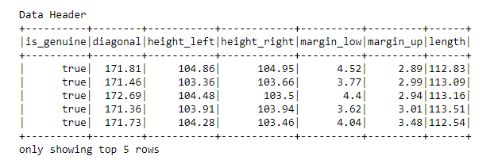
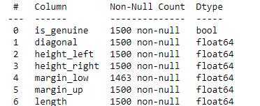

# Counterfeit Solution with Machine Learning

Implemented a Python Machine Learning Model based on geometric dimension data of euro banknotes with Sklearn and StatsModel...

**Tools**

## Data Pre-processing

Used **Linear Regression to predict missing values**.

Used a **Principal Component Analysis** to explore and understand data.

## [Analysis](./Analysis.ipynb)

Used Kmeans algorith to classify.

**KMeans** Model with sklearn.

Tester l'appli: [Fake Notes Detector](https://alhasdata-fakenotes-dectector-main-ff5ra5.streamlitapp.com/)

