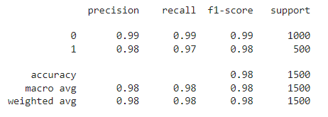
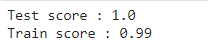

## Counterfeit Solution with Machine Learning

In this [Project](./Analysis.ipynb), we built a **Euro banknotes counterfeit solution**.

We implemented 2 different models for to predict couterfeit:
- 1 Supervised machine learning model : **Logistic Regression**
- 1 Unsupervised ml model : **KMeans**

We trained the models with geometric dimension euro banknotes data.

You can try the Logistic Regression model with this [Frontend App](https://alhasdata-fakenotes-dectector-main-ff5ra5.streamlitapp.com/) created with **Streamlit**

#### Tools :

### Pre-processing

We used **Linear Regression to predict missing values**.

We used a **PCA to reduce dimensions, explore and understand data**.

### KMeans model

### Logistic Regression model

### Frontend application

We create a [Frontend App](https://alhasdata-fakenotes-dectector-main-ff5ra5.streamlitapp.com/) with **Streamlit**

